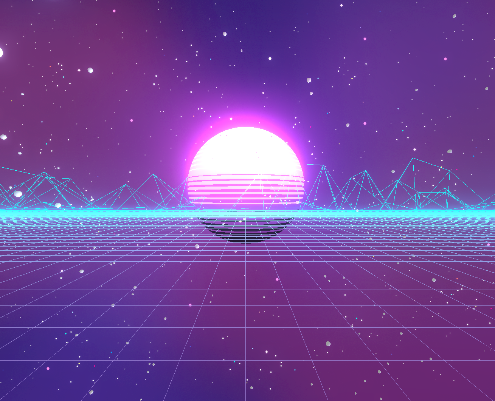

# Portfolio Website

to use:  
`npm install`  
`npm run dev`  

## links:
* [main inspiration](https://atelier.net/virtual-economy/)
* [getting a grid of quads](https://discourse.threejs.org/t/wireframe-of-quads/17924)
* [spinning knot thing](https://codepen.io/tr13ze/pen/pbjWwg?editors=0110)
* [stars and move camera on scroll](https://github.com/fireship-io/threejs-scroll-animation-demo/blob/main/main.js)
* [mountans](https://observablehq.com/@sw1227/mountain-terrain-3d)
* [sun, background, and shaders](https://betterprogramming.pub/synthwave-scene-my-coolest-three-js-project-yet-6359c38dfd08)
